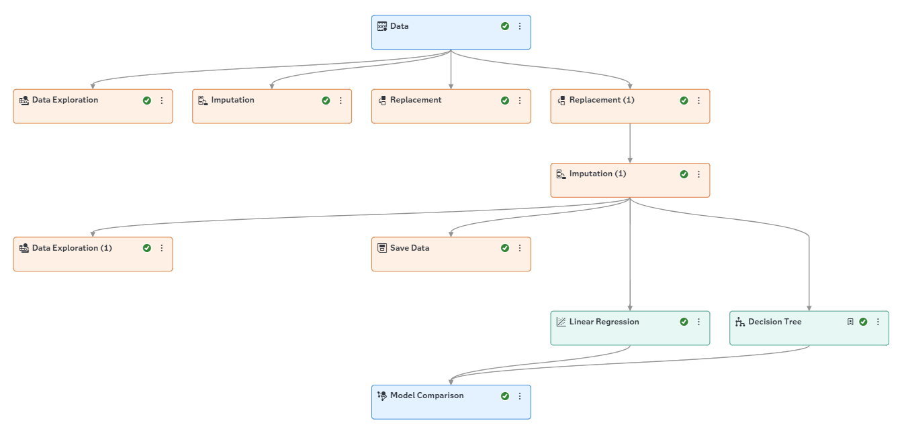
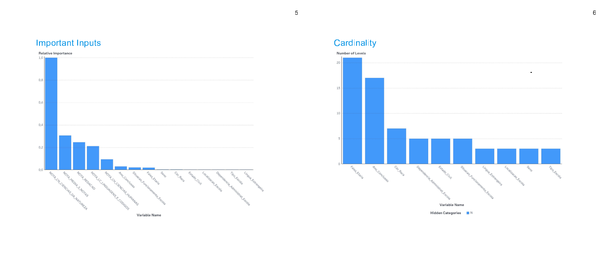
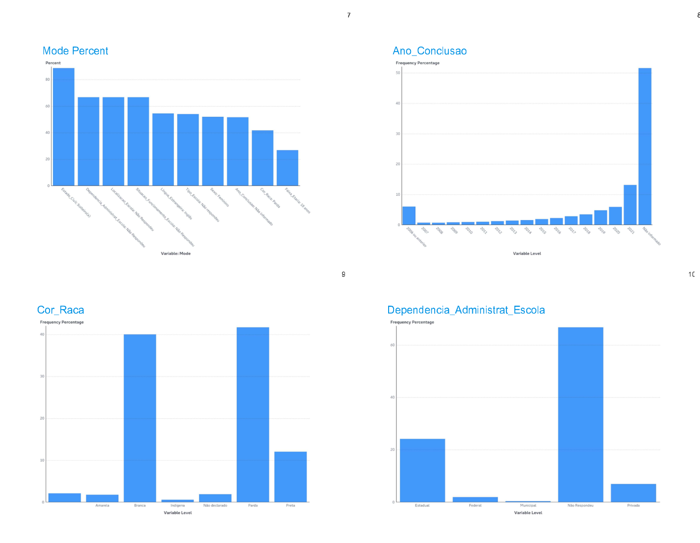
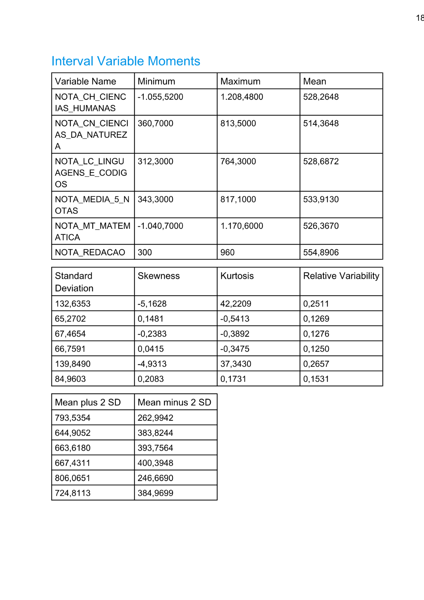
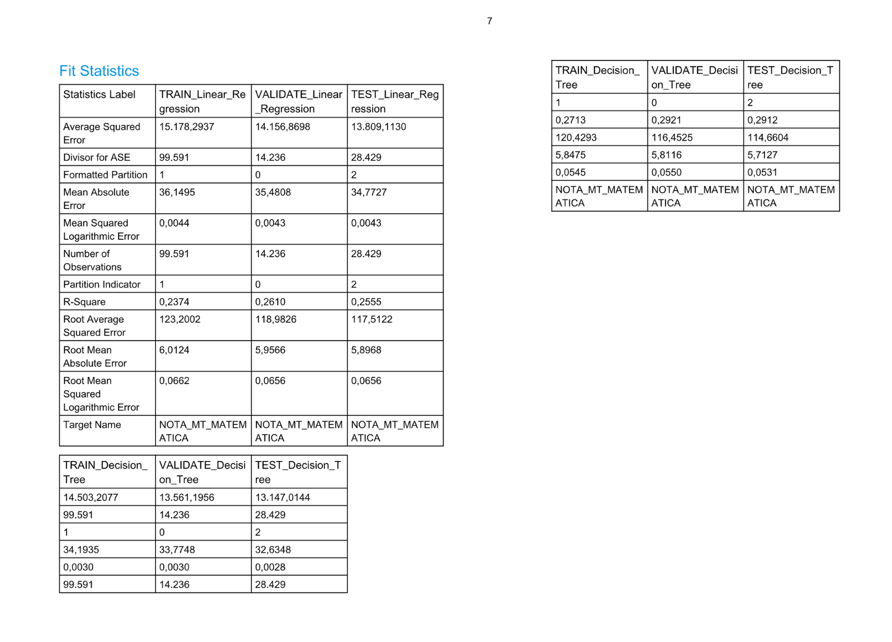

# Machine learning aplicado aos microdados do ENEM utilizando SAS Viya

**Objetivo**

Aplicar técnicas de Machine Learning aos microdados do ENEM utilizando a plataforma SAS Viya, explorando etapas de preparação de dados, construção de modelos e avaliação de desempenho.

**Fonte dos Dados**

Microdados do Exame Nacional do Ensino Médio 2024 (ENEM).

**Ferramentas Utilizadas**

* SAS Viya

**Etapas Desenvolvidas**

* Seleção e preparação da amostra de dados;
* Tratamento e organização das variáveis;
* Análise exploratória dos dados;
* Construção do fluxo analítico em ambiente visual;
* Treinamento e comparação de modelos de Machine Learning;
* Avaliação de métricas de desempenho.

## Pipeline Analítico

## Análise Exploratória

## Comparação dos Modelos

